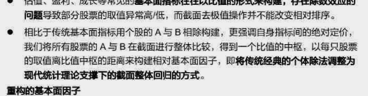

## 第二周

### 星期一

- 发现忘了备份了靠，服务器换了之后东西都没了
- 先从量价因子出发尝试，弄一些因子出来，试试效果怎么样
  - 先从那个因子日历上有的东西开始找
  - https://www.joinquant.com/help/api/help#factor_values:%E8%B4%A8%E9%87%8F%E5%9B%A0%E5%AD%90
  - 上面这里是聚宽的因子相关的东西
  - 或者可以先尝试尽可能多地复现一些已经有了的因子
  - 好像说有什么可以加速运行速度的方式
- 过去一段时间中收盘价和成交量的相关系数，然后对市值做中性化处理，过去什么时间段的都可以
  - 金融意义：价格和交易量的关系是否稳定，认为越稳定的越好
  - 所以不一定要使用收盘价，对于价格可以有很多中定义的方式
  - 也不一定非要是当天的价格，可以结合过去一段时间的价格来使用
  - 成交量就当成交量来用就好了
    - 问题是有很高的相关性
  - 把过去几天的情况加权综合起来，效果会稍微好一些
    - 但还是和已经有的因子的相关性很高，并且都是量价相关的因子
  - 用close的return（过去几天的？）来代替close的价格，或许也可以把volume也修改成这个样子的
    - 不过好像return不是一个比较好的思路，之后应该再去仔细尝试一下

- 过去一段时间中成交量的变动速率，衡量市场如何判断这支股票
  - 金融意义：市场整体对股票预期的变化，可能也可以从订单数中反映？
  - 这个应该越短越好
  - 或许可以从价格的变化这种直观的方式中衡量，这样可以把市场去掉
  - 和close的变化相乘之后效果好了不少，但是IR和收益率比较低
- 整体的问题在于，可以通过这种调整来提升表现，但是不能通过调整来避免相关性变高
- 过去的n天中整体有多想买：今天high - 昨天close和昨天close-今天low的差距
  - 给的是用除法，但感觉减法或者什么别的衡量方式也可以
  - 不过还是那个问题，你没办法通过这种操作降低相关系数啊....
  - 减法会比除法好一点，但是相关系数还是挺高的hhhh，没有什么办法
- 体验是，大多数的因子基本都被尝试并纳入了，所以你再尝试这方面的东西也没什么用

### 星期二

- 先把gre的东西弄了，把整个的流程定下来
- 今天最后尝试一天量价因子，然后就去尝试别的方向
- 说传统的基本面和量价基本上都被尝试过一遍了，以及我也不打算去具体清洗数据
- 尝试一下比较复杂的一个量价因子，发现没有卵用
- 看到了上一个人做的情绪方面的因子，感觉可以试试，他是用的wind上面的数据内容
  - 偏移，情绪，概率什么的
- 之后提交一下，问问除了因子之外还有什么可以做的，不太像在这个方面浪费很多时间
  - 主要是我希望实习内容硬一些，不要说就是这种让我自行尝试的
  - 可能明天或者后天的时候去问一下，感觉这个事情还是蛮重要的
- 量价还是不尝试了，试试基本面和别的方向，把所有的数据都尝试用一下，尤其是估计没人用过的
- 因为需要找到之前的实习生没有用过的，那只能从更冷门的数据的角度出发来尝试了
  - 以及可能需要用python写？不知道表达式还适不适用
  - 以及需要问问gls那些数据具体从哪里读取，不过可以自己先试试

### 星期三

- 今天就整理一下有哪些方面的因子可以试试，然后分别尝试一下看看效果

- 主要还是看看数据，弄清楚具体怎么用，可以问问gls
  - 以及顺便问问能不能做除了因子之外的方向，或者有没有明确一些的思路

- xhs似乎有不少人在分享自己的方法，不过感觉可能效果也不会很好吧

- 鼓足勇气找mentor问了能不能换一个更贴近专业内容的方向

  - 不知道这个结果算是被拒绝了还是说可以
  - 反正要表达出来，希望能做更加实际的项目一类的，能不能不是因子的内容，有更多硬核一些的coding的

- 感觉浑身没劲，不知道为什么，得赶紧把语言考试的准备计划定下来，哎

  - 可能应该先做一套gre的题，看看效果怎么样

- 想要问的

  - 能不能换方向，更确定一些的项目那种的，并且有更多coding内容的，这样一直挖感觉没有学到什么，也没有做出来什么
  - 如果是因子的话，能不能推荐一些方向，感觉降低corr不太符合正常思考方式
  - 数据具体怎么查看，直接在python中print出来是数据的格式（可以不问，再看看上一个人的代码决定）

- idea

  - paper和研报
    - 如果是paper的话只需要看摘要
    - 研报比较好读，重点从研报的idea部分入手
    - 要打破思维定式，具体一些思考问题，比如不同规模的公司是否表现不同

  - 重点是从idea的角度，尤其是从金融方面，要能讲明白底层的逻辑是什么，想法是什么
  - 实现idea，尝试然后看看结果
  - 基本面其实挺接近价值投资的，就像自己要进行投资的想法一样
    - 就是把想法用算法具体实现出来

  - 如果有一个想法，要先专注于整体什么表现，而不是具体的细节，这样可以防止出错，并且更加专注于内容
    - 就是说代码可读性要尽量好，尽量直观易懂
  - 在他们看来，这种idea的尝试更多是一种练习，没有被指望说能弄出来什么

### 星期四

- 需要找找从哪里读研报，那个框架具体怎么用，之后可能就来活了（操，突然又不想来活了，呃呃呃呃呃呃呃呃呃
- 以及必须必须把gre和toefl的框架弄出来了lol
  - gre平时用小程序背单词，要记得一起弄verbal的题
  - TOFEL先把听力和阅读刷好

- 可以弄弄基本面的东西，主要是弄明白那个框架的表格怎么弄
- 之前说的是，可以考虑用比较久的历史数据，并且不一定就要认为近期的数据权重就会更大
- 基本面是什么表现的公司好
  - 要记得如果想用这个数据的话，需要先直接用这个数据当指标弄个alpha看一下效果
  - 有可能这个数据存在的量很少，不太能用
- 认为员工福利比较好的公司会最终表现好，或者说工资高的表现会比较好
  - 弄一个衡量公司员工待遇的因子
  - wind/income/'WORKERS_WELFARE' 发给员工的福利，并不是总是有，得用if else来判断
  - wind/income/'DISTRIBUTABLE_PROFIT_SHRHDER' 盈余公积金，应该也是event数据
  - 资本公积金，balance里面的
  - balancesheet里面的应付职工薪酬
  - 或者cashflow里面的付给职工的现金，同样也是event数据
  - 但是需要把公司负债方面的因子给regression掉，这需要也弄一个负债的因子
    - 用一些变量衡量公司的负债，然后从该发的工资里面弄掉
    - 比如balancesheet里面的流动负债合计，因为工资应该是一个流动的负债
    - 不知道为什么，上面的这个就是不太能用。。。。。
    - 同时要记得对整体的公司规模

  - **要注意一下这些变量好像基本上都是不怎么改变的，如果算变化的值的话肯定会出问题，基本面数据也确实是这个样子的，并不是每天都改变，所以整体是判断后长期持有的方式**
  - 这样的话或许应该使用rank的方式处理
  - 应该在公司之间比较，并且把换手率弄低一些

- 或者看公司的收入是否稳定，用之前的profit和asset的return的corr的std来衡量
- event类型的数据很多时候可能都是0，更多需要用在if else的环节上额外用来进行什么操作，不能直接拿来当一个变量
- 
- 也可以用turnover衡量定价效率，然后用之前的数据确定如何修改定价的模型（通过基本面计算价格应该如何变化），然后做一个预测
- 或者可以弄长期发展的指标
  - 研发支出 balancesheet里面的 可以当长期的计划的

### 星期五

- 看看之前弄的这些，把idea都尝试一下然后整理起来

- 工资的那个，直接把三个指标加起来了，可以用别的方式组合一下

  - 直接把盈余公积和应付职工薪酬加起来，结果效果还可以

- 看看三个指标之间的相关性如何

- 以及需要把那些并不符合格式的整理起来......

- 直接把这些东西放在一个专门的文件里面得了

- 如果一个指标低于零，可能就不会去用了

- 差不多就这样吧，好困，好烦，一想到要出成绩就什么都不想干

- 两个语言考试也感觉完完全全准备不下去

### 星期六

- 熬夜看了欧洲杯，晚上干了什么忘了

### 星期日

- 弄了一天简历、推荐信和领英主页的事情，结果还是没弄出什么来
- 发现腰部力量太弱了，耐力也不行，现在身体状态有点糟糕，硬拉居然腰先开始疼
