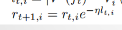

### 这部分说大作业相关的东西

**大致概括**：

- 提出了一种新的募资算法，在二次方融资算法的基础上优化（需要能解释二次方融资算法是如何运行的），规避掉了二次方融资的三个弱点（需要能具体解释是哪三个弱点）
- 具体解释这个算法的流程是什么
- 对算法进行测试，和二次方融资算法的结果做对比

#### 研究背景or灵感来源

- 项目需要融资，目前的quadratic funding的融资方式效率太低
  - **解决的问题**：我们现在拥有一笔资金，如何分配给几个项目
  - **解决方式**：让这几个项目去面向大众接受捐款，根据收到的捐款来计算**权重**
  - **如何计算权重**：对于这个项目收到的所有捐款，每笔捐款资金的平方根求和，对总和取平方并乘以特定常系数，再减去项目收到的所有捐款的平方和
  - **目的**：弱化捐款额度的影响力，重视捐款笔数的占比

- QF存在的问题
  - 容易被女巫攻击（把大额捐款分成小额捐款）干扰
  - 没有利用好之前的项目的判断经验
  - 面向社会大众采纳经验，外行指导内行

#### 具体解释算法

- 基于一个专家团队的评价方式，每个专家有一个声望值，他会对项目推荐一个投资水平并估计一个效用
- 用专家声望值作为概率，随机选择一名专家的意见来采纳，按照专家的意见投资
- 然后所有的专家再对于这个项目提交他们估算的效用函数和在这一效用函数之下最优的投资额度，同时实施项目，以得到一个结果
- 将结果和专家估算的结果比对，更新专家的声望值
  - 原来的声望值乘以损失的函数

#### 对算法进行的模拟测试

具体如何进行的模拟，结果具体如何，能否定量，把整个逻辑弄清楚

- 用到的测试数据
  - 是使用python模拟的投资环境生成的：**解释具体是如何生成的**

认为项目的情况（指数分布和正态分布的乘积）和专家的判断能力（正态分布）都是随机生成的，然后按照这个规则去操作，看哪种判断方式最终的投资收益效果好

会存储算法的损失值（和理论最佳可能结果差异的相对大小）和算法造成的社会福利大小

