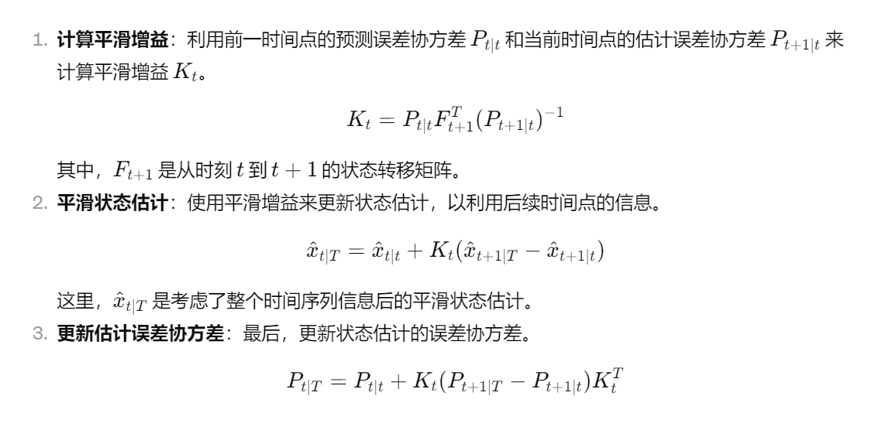

#### 这里把第十一讲的内容补上

- GDP: Gross Domestic Product
  - the monetary value of all finished goods and services made within a country during a specific period.
  - 有三种不同的计算方式：expenditures (spending), production, incomes
    - 理论上，这三种不同的计算方式应该得到相同的结果
    - 但是实际操作中，因为存在数据收集和统计的误差，不同的计算方式一般得到的结果是不同的
  - real GDP: 把inflation从GDP中去掉
  - 在很多情况下，关心的是GDP的变化率而不是GDP本身
- kalman filter
  - 主要参照的这篇文章学的：[How a Kalman filter works, in pictures | Bzarg](https://www.bzarg.com/p/how-a-kalman-filter-works-in-pictures/)
  - 核心的目的是：预测下一时刻的我关心的状态的信息
  - 基于的信息是：**上一时刻**的状态，我对这个系统变化方式的建模，传感器的相关信息测量
  - 我们得到的预测结果都是Gauss分布的
    - 通过传感器的信息可以得到一个结果
    - 通过上一时刻的信息和变化模型可以得到另一个结果
    - 这两个结果都是Gauss分布的，可以分别计算出当前状态为某个特定值的概率是多少
  - 可以通过将这两个结果计算出的概率相乘，得到的是当前状态同时符合两个预测结果的概率是多少
    - 这样得出的结果依然是Gauss分布，只是不符合归一化
    - 因为这两个分布理论上是独立的
    - 所以可以得到新的状态均值向量和协方差矩阵
  - kalman filter可以看作bayesian inference在Linear Gaussian Model下的特例
  - kalman filter属于state space model
    - state equation：通过上一时刻的状态推测下一个时刻的状态
    - observation equation：通过观测数据推测系统状态
    - 结合这两个观测的数据结果，可以推出整体的结果

- kalman smoother
  - 和kalman filter的原理类似，但是使用**所有时刻**的观测数据
    - 这里的所有时刻包括之前的和之后的
  - kalman filter是我在这个过程中就可以使用，修正当前时刻的数据
  - kalman smoother是必须在整个过程结束之后使用，基于整个过程所有的数据来修正历史
  - 似乎是把filter从前往后和从后往前交替使用

#### Bayesian inference

贝叶斯推断，是一种思路or方法，不是一个模型

- prior distribution
  - 先对数据符合的分布有一个大致的估计，同时对分布的参数也给出估计
- likelihood function
  - 使用MLE基于有的数据得出这个分布的具体参数
- posterior distribution
  - 使用贝叶斯公式，基于先验的估计和MLE的结果，给出参数的后验概率分布
- bayesian inference
  - 使用后验分布进行相关的推断

#### 大作业做了什么事情

文章中只说了用bayesian inference，我选择了kalman filter和kalman smoother作为先验的模型（这样可以表示我其实也没有办法具体比较，并且文章其实没有提供具体的数据，只能把线条和图像重叠起来比较）

对于中国和美国的数据

- 对GDP的变化列出来符合kalman filter的两个方程要求的模型
  - 就是论文中给的模型

- 使用爬虫获取美国和中国的在两种计算方式下的GDP的数据
  - 这个就是直接获取，没有什么很花俏的地方

- 使用MLE的方式估计我列出来的方程中的参数，和paper中的结果比较
  - 在给出模型的时候对参数做相应的估计（基于历史数据和经验估计）
  - 之后使用MLE基于我收集到的数据，给出来参数的概率密度函数
  - 之前的估计是先验的结果，之后的估计是新的条件，使用贝叶斯公式（条件概率公式）重新得出概率的后验密度函数
  - 取后验密度函数的MLE，作为估计的结果
- 用kalman smoothing弄一遍，把结果和实际的结果进行比较
  - 结果是对GDP变化率的预测
  - 进行反向的平滑处理，使用所有的结果更新GDP增长率的预测值

Rauch-Tung-Striebel (RTS) Smoother 是一种针对线性动态系统的平滑算法，它在Kalman滤波的基础上进一步提高了状态估计的准确性。RTS Smoother 通过一个两步过程实现：首先正向通过时间序列进行Kalman滤波，然后反向通过时间序列进行平滑。这里是RTS Smoother的具体操作步骤：

### 正向传递：Kalman滤波

在正向传递阶段，RTS Smoother 实现标准的Kalman滤波算法，逐步通过时间序列。对于每个时间点 \(t\)，执行以下步骤：

1. **预测**：基于前一状态的估计和系统模型预测当前状态。
2. **更新**：当获得新的观测数据时，结合观测模型更新状态估计。

这个过程产生了两个重要的结果：每个时间点的状态估计 \(\hat{x}_t|t\) 和估计误差协方差 \(P_t|t\)。这些结果将在反向平滑过程中使用。

### 反向传递：平滑

在所有数据被正向处理之后，RTS Smoother 开始其反向传递，从时间序列的末尾开始反向通过每个时间点。对于每个时间点 \(t\)，从 \(T-1\) 到 0，执行以下步骤来修正状态估计：

通过这种方式，RTS Smoother 能够有效利用未来的观测数据来修正过去的状态估计，从而提供比单纯使用Kalman滤波更准确的状态估计。这种算法特别适合于那些在整个数据序列收集完毕后需要对过去状态进行重新估计的场合。

