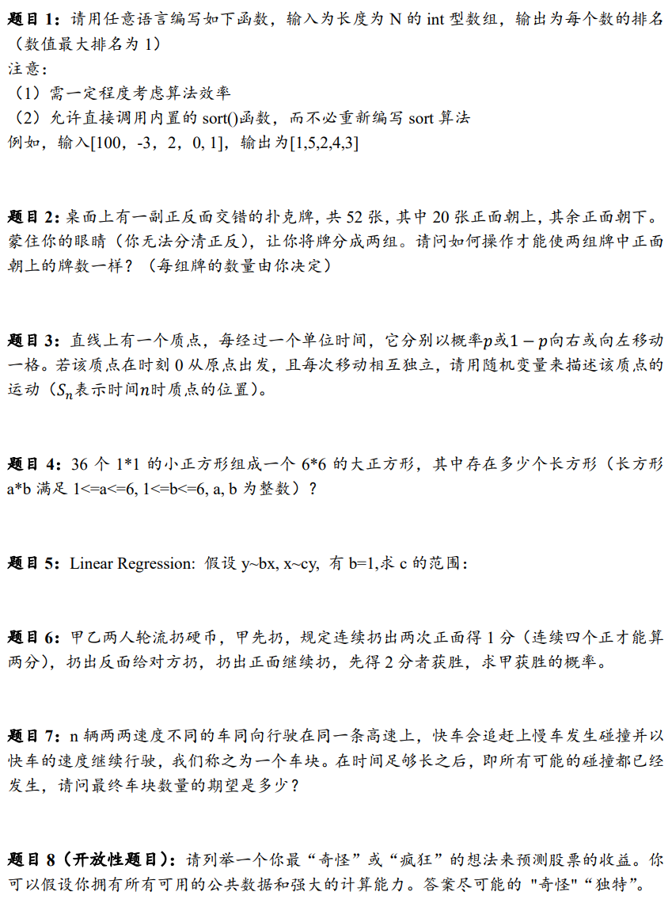

# 笔试

## 内容

- 给30min，一道gpt秒杀编程，一道开放性创造力题目，剩下的基本上网上都可以搜到
  - 问了概率论，bt，统计学，编程算法
  - 绿皮书还是比较重要的
- 题目1234都对了，5没看懂是什么意思（但是之后的第二轮面试问了），6给出来了递归的公式但是没写完，7算到最后给出来了递归公式得到的级数，但是不会算级数加起来结果是多少

## 总结

- 整体来看**笔试还是比较能反映之后面试重视什么内容的**
- 大家关注的基本都是：概率论，统计学，bt，基础的编程算法
- 做笔试的时候一定要记得把gpt打开

# 第一轮面试

## 面试内容

面试官是本科学数学的

- 自我介绍
- 狠狠扒实习经历
  - 具体问指标是怎么定义的，策略的内容是什么，我做了什么
  - 需要整体的操作，问专业的内容（换手率，调仓频率，回测框架，收益率）
  - 说的非常不流畅，之后需要能把这段summer的经历理清楚能自己讲明白
- 问C++的内容
  - 继承
  - 重载
  - 虚函数
- 200个点回归，分成两组，有没有可能两组内部回归出来斜率都是正数，但是一起回归斜率是负数
  - 有可能，比如两组点分别在第二第四象限
- 在二维坐标系中，(1, 0), (0, 1), (1, 1) 构成的三角形内 uniform distribution 无数的点，对他们做OLS的话结果是什么
  - 在x轴的方向考虑，微积分 & 贪心算法的思想，结果是中线
- 一开始没做出来，给了一个上面这道题的引子
  - x对y做回归得 x = a1 + b1 * y
  - y对x做回归得 y = a2 + b2 * x
  - 求b1 * b2的结果如何？是等于1，大于1还是小于1？
  - 结果是小于1，列出来回归的公式（相关系数的），相乘的话由柯西不等式是小于1
- Gauss-Markov假设的五条要求
  - linearity：线性关系
  - 残差均值为0
  - 方差恒定
  - 不同的残差之间不相关

- 绿皮书上的题，把线段随机分成n段比大小的方式换成排列来做

## 总结

- 问的非常非常全面，C++在oop那里的基础知识还是需要弄明白（可能也包括没有被问到的内存）
- 给的建议是不要着急给答案，最好想清楚把细节弄明白再回答，自己在沟通和交流上做的比较好
- 以及在统计学（数学）、金融和计算机这三个方向上，要选择一个方向作为自己的比较优势，不然可能会被三个方向的专家竞争掉

# 第二轮面试

面试官是本科学计算机的

## 面试内容

- 一开始问对于量化的理解，认为量化和传统投资的区别是什么
- 然后深挖实习的经历，主要聚焦在具体策略表现的细节和整体的思路，也是差不多拷问了20min
  - 能感觉到我说的还是很不流畅，申请面试之前一定要能做到自己独立把summer的内容说明白

- 什么是逻辑回归
  - 如何确定逻辑回归的参数
  - 使用什么损失函数
  - 什么是交叉熵损失函数
- 什么是降维
  - 什么是主成分分析
  - 什么是矩阵的特征值和特征向量
  - 特征值和特征向量的意义是什么
  - 有什么应用
- 什么是卷积，作用是什么
- CAPM模型是什么
  - α和β是什么，如何定义的
  - 如何根据具体的数据计算α和β
- 什么是C++中的虚函数
- 具体的实际编程问题1
  - 有一个dataframe，有两列，第一列是股票的id，第二列是新闻的id，每一行的值代表新闻中提及了股票，一共有20万行。需要计算指标，逐行去看，不同两行中的股票id不同，新闻id相同时，这时让这两支股票的relation+1。我需要遍历所有的数据，找到relation最大的组合
  - 问如何设计python的算法实现
  - 要求具体说到伪代码和存储的方式
- 具体的实际编程问题2
  - 有一个随机变量，每秒钟更新一个新的值，每次更新都需要计算在过去10min内最大值是多少，如何设计算法
  - 回答到使用deque，每次删除所有比当前值小的值和过期值的时候让我不用说了

## 面试官的反馈

- 需要找到自己的发展方向（数学or金融or计算机，reseacher还是ML还是trader）
- 金融是业界和学界割裂严重的学科
- 现在应该多实习，尽可能去尝试方向
- 确定自己的发展方向然后全力去卷 vs 尽可能广地学东西然后去探索
  - 这两个方向是矛盾的，其实也就是学界和业界的矛盾
  - 这没有办法，什么时候选择只能看自己

- 面试会非常重视之前的实习经历，会狠狠地挖，一定要准备的非常充分
- 包括简历相关的内容也是
- 以及整体来看好像不是很重视项目经历，加上去的项目经历也从来没人问过，课程大作业还是应该少写点
- 没有给对这次面试的具体点评，表示所有的面试基本都是问实习经历和数学编程的问题

## 总结

- 数据结构的内容感觉还是挺有用的，很多时候都会问到这相关的·

- 确实完全不重视项目经历，加上的大三上的那两个课程项目完全没有被问过

- gpt非常非常重要，很可惜到时候面试的时候是不可能有机会用gpt的，学过的东西必须记清楚

- 这一场主要是深挖对于概念的掌握，没有问考察智力水平的问题