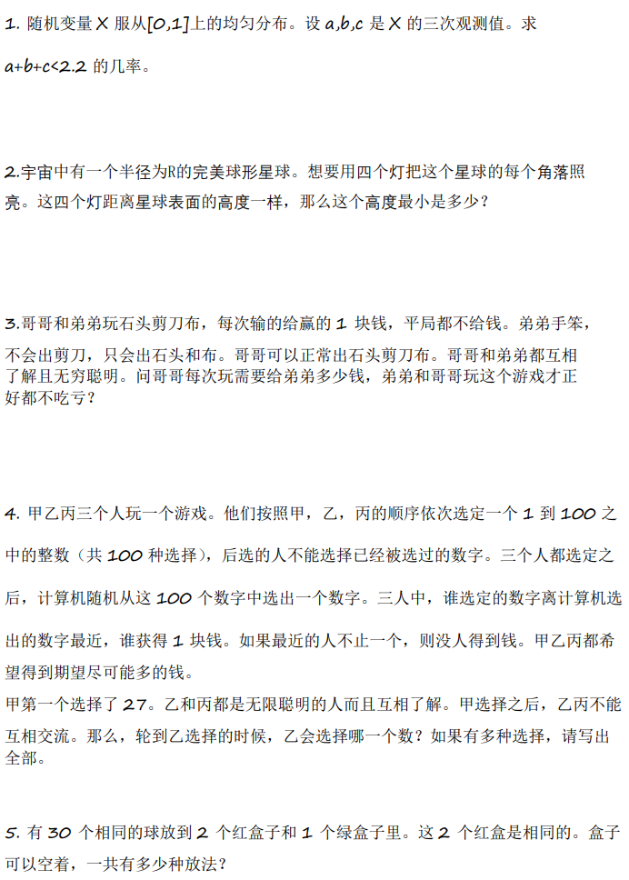
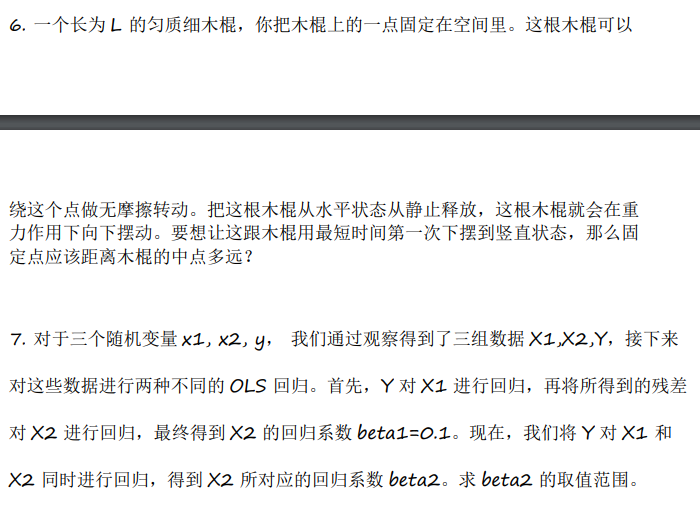

# 笔试

## 内容

- 给90min

## 总结

# 第一轮面试

## 内容

- 非常抽象，就是给我报题目，然后让我做完听结果，也不听过程，而且给的并不tricky，就是在那里嗯算的题目，傻逼地方
- 面试我的人在面试我之前完全没有看过我的简历，现场看现场面试，基本就没问我简历里面的内容，纯纯的傻逼，很不用心
- 绿皮书里面的题，10红20绿30蓝
- 单位长度的线段随机分成n段，求最短的一段的期望
  - 对概率积分硬算
- A是方阵，A^2是零矩阵，A中只有0和1，问A中最多可以有多少个1
- 甲胜率1/3，乙胜率2/3，甲两连胜or乙四连胜则结束，求甲结束的概率
  - 直接列马尔可夫状态转移方程硬算
- 甲乙两个人，都有1-8的牌各四张，轮流出牌，谁出牌后所有出的牌的点数之和大于等于40就输了，有人有必胜策略，问是谁，策略是什么
- 2000守卫，1个永远说真话，1999个永远说假话；2000宝箱，1个真的，1999个假的，问最少问多少个是否的问题能一定找出来真的宝箱
  - 11次就可以
  - 随便挑一个，问剩下的1999个守卫中的最少的人会说什么，二分
  - 挺傻逼的

## 总结
