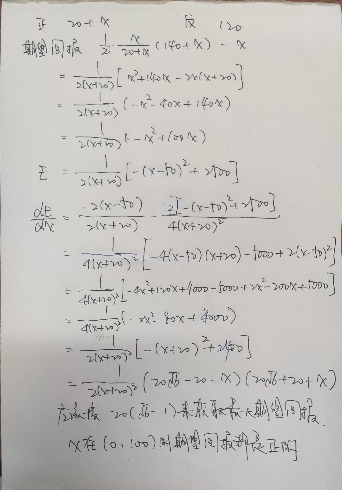

# trader

## 线上oa

- 五个部分，总共2-3个小时，很像是智力测试和反应协调性测试这种

## bq

- 根据网上的面经来的，比较常规

## tech

### 问过的问题

- 计划50min左右，我表现得不好被提前结束
- 三道概率论的题，一道mm game
- 概率论的题目不允许使用纸笔，mm game可以
- 会给hint，不要求直接做出来，但需要对hint正确反应

#### 第一个问题

估计一定范围内有多少的质数，回答的还可以，感觉知道慢慢变稀疏就ok

- 首先让我估计
  - 1到100里有多少质数，30s
  - 1到1000有多少质数，30s
  - 1到10000有多少质数，30s
- 然后给出结果，让我调整
  - 告诉你1到10000有多少质数，调整对之前的两个范围的估计
  - 要求给出100%的置信区间

#### 第二个问题

一直扔骰子，往1000逼近，估计最后一位

- 首先问只有一个骰子，一直扔直到总和大于等于1000，问最后数值是多少
  - 这里我认为我明白了，其实我没有理解清楚，他想问的是最后骰子的数值，我理解成了最后总点数的数值
  - 数值自然是6，因为在每个点等概率的情况下可以cover尽可能大的范围
- 然后问给你两个骰子一直扔，直到总和大于等于1000，问最后数值是多少
  - 这里需要综合考虑数值出现的概率和cover的范围，并尽可能定量计算
  - 我一开始没有定量算，就是认为均衡一下就可以了，给了大概是8或者9
  - 他引导我具体计算7、8、9出现的概率，发现其实是7
  - 我在这里很注重把自己的思维方式说出来，感觉加了不少印象分

#### 第三个问题

掷一定数量的硬币，判断正反面，使用概率分布估计

- 扔100个硬币，问正面的期望和标准差
  - 这么简单的问题肯定是一个提示，但是我没有注意到
- 然后估计扔100个硬币，50个正面50个反面的概率是多少，精确到小数点后两位
  - 我的想法：使用正态分布近似伯努利分布，瞎蒙了这个峰值的概率，说0.03
  - 给hint：使用σ框出来的估计区间来做，算期望和标准差也提示了这一点
  - 一个σ之内的区间是[45, 55]，知道范围是68%，可以在这个区间里估计峰值
  - 然后要求给出100%置信区间的范围是多少
- 然后问，有一个股票，在之后的100天里每天可能涨一块钱或者跌一块钱，在100天之后的股票价格的期望和标准差是多少
  - 很明显是硬币题的变种，股票价格就是硬币正面减去硬币反面，再加上100
  - 现在看其实很明确，正面数量和反面数量其实是概率对称的，正面的标准差是5，那正面减去反面其实就是两倍的正面的标准差，应该是10
  - 或者郭迅的思路，结果其实就是$100+正面-反面=100+正面-(100-正面)=2\times正面$，所以标准差是正面的标准差的两倍
  - 其实给了相当多的hint，但是我因为慌乱大脑空白没能及时反应
  - 估计之后会有别的问题，但是因为我没能回答出来被直接掐掉了

#### mm game

- 四个人赌一个均匀硬币的结果，要求观察判断规律，提示是存在正期望的策略的
  - 首先给了要求是操作的次数不能超过23轮或者5min，我当时没有从上一道题没有反应过来的心态中调整过来，脑子还在想着上一道题，就没有听明白
  - 然后我没有注意那四个人其实出手都是存在规律的，只是单纯在疯狂尝试
  - 给了hint，发现一个人总是赌正面，要求我在假设另外三个人随机出手的情况下构造正期望的策略
    - 精确计算显然是可以算出来的，但应该快速正确反应投多少钱的时候是赚的：在使得两边投入的总钱数相同之前，投钱都是赚的
  - 如何估计：以正面投了20￥，反面投了120￥，我应该投正面多少为例
    - 估计的话，应该先列出来期望回报的式子$\frac{-x^2+100x}{2(x+20)}$，然后估计下，分子在$x=50$的时候最大，但是这时候分母变大了显然不是最大，所以应该让分母小一些，这样最优的点就是落在一个区间$(0, 50)$里面，可以大概蒙一个25左右的值

事后精确计算的结果：最优的值是$20(\sqrt{6}-1)\approx29$，这样估计还是比较精确

- 被追问能否判断出来：
  - 押钱赌硬币扔出来结果，判断正面还是反面。正面押了120￥，反面押了20￥，问你用100￥押反面期望是多少，给5s
  - 答案应该是0，但是我反应错了，说的是期望是负的
  - 因为没有回答出来这个就结束了

### 给的反馈&自己的总结

- 没有把问题弄明白就开始回答
  - 就算觉得自己理解了，也应该重新确认把问题在问什么弄明白
  - 一直投一个骰子，达到1000的时候数值是多少
    - 这个问的是骰子的数值，不是总的数值
    - 觉得自己理解了就没有问，实际上就算理解了也应该确认一下
  - mm game那里，说不能超过23轮和5min，但理解成了或
    - 因为还在想之前犯过的错
    - 因为走神了，没有专注于面试和问题本身

- 没有足够冷静地在把式子想一下列出来，其实时间是足够列式做的
  - 标准差的计算那里，判断一下就是两倍的正面结果
  - mm game的估计最优投入资金那里，如果把式子先列出来就可以很容易判读那
  - 其实这些问题如果有纸笔的话就会很容易，但不让使用纸笔并不代表就纯粹需要用判断方式估计，也应该在脑子里面把式子大概列出来想一下

- 让前面犯过的错误影响了自己之后的状态
  - 硬币算期望的题被结束之后，还在继续想
  - 题目答错之后没有很快能够弥补，而是直接就慌了
    - 需要在题目答错之后保持冷静，不能还在继续想之前犯过的错误

## final

- 上午是mm game，对于条件期望算错了
- 下午就是做笔试卷子，内容偏绿皮书的东西
- 然后对上午的mm game复盘，分析谁好谁坏，自己的每一步操作好还是坏
- 最后面试tech和bq，疯狂算很多很多东西，脑力的耐力不足基本都算错了

# data science

## oa

- 挺难的，而且整体很奇怪，最后第一题做出来了第二题死活不会，应该是直接寄了