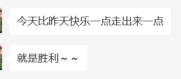
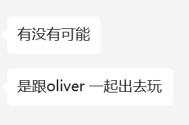

## 第三周

前两周还是没做什么事情，到底是因为e还是因为懒。。。

### 星期一

- 午饭时间都完了，才下床
  - 有点点是因为e，但感觉主要还是因为懒，以及熬夜看球没睡好
  - 不管怎么样，请专注在**这学期的课**，**托福**和**找实习**上面，不要总想着已经和你无关的事情
  - 反正人家都有喜欢的人了，专注做自己的事情得了，又不喜欢你，憋住了别bb
- 吃完的时候还是在瞎摸鱼
  - 感觉戒不掉知乎弱智甜文，也戒不掉青春傻逼电影
- 肯定有一天会走出来的
  - 就像高中以为自己可能永远忘不掉sjm了，但现在上课看到也是内心毫无波澜
  - 将来看肯定肯定有一天也会走出来的，只是现在还没准备好
- 一整天也没干什么正事，勉强弄出来博弈论的作业，重点还是要**早睡早起**。
- 越来越不懂，就这样吧，尽全力忘掉，要**多去回忆曾经有多疼，不能好了伤疤忘了疼**
- 虽然现在还是知道了有喜欢的人不高兴，看到和别人亲密不开心，但是肯定会走出来的
- 就这样吧妈的，两天弄一门课的一次平时作业，效率实在是低的太离谱了

### 星期二

- 因为e和冷以及带手机上床叠加起来，再加上晚上因为补作业三点才睡妈的，12点才下床

- 下午去图书馆把数值分析的第二次作业写了，但是也没干别的事情，晚上上课，跑步，回宿舍
- 看到了送到机场，不高兴，为什么还会不高兴md，有了喜欢的也和你没有关系啊
  - 但是不懂，到底为什么，明明觉得自己也不差。好烦 好烦好烦好烦 又不高兴又烦 想哭还没理由
  - 烦死了md，也不高兴，为什么为什么他妈的，还是早点睡觉吧。。。
  - 烦死了烦死了烦死了，不开心，过去在意了这么久的人被别人快速地夺走心，好不开心
- 为什么总是在自己不开心的时候见到别人的幸福，好烦好烦好烦好烦好烦好烦好烦mdmdmdmd
- 🐻真的好会说，可惜我永远做不到。。。。

- md，至少要做到零点之前睡觉。
- 好烦人，睡觉之前被一句话破防，果然还是压根没有放下，以及不得不承认说的很对。

- 好烦好烦好烦好烦，真的好烦
- 很庆幸，没把这个博客的链接告诉任何人，不然真没地方发泄情绪了，好不高兴妈的
- 又没有可哭的哭不出来，又没有可生气的无法愤怒，只是也说不明白的难受，好讨厌。
- 睡觉睡觉睡觉睡觉，心里的感受感觉小丑到没有办法和任何人说，只能给关心我感觉的人提供不真实的信息
- 还是睡觉吧，不能多想也不该多想
- 一定一定一定会走出来的，未来一定会走出来的
- 真的好难受，不想被怜悯，不想被可怜，但是好难受，又没资格难受
- 好想被抱着，可以放肆地哭出来，不用担心被听到，好难受，明天还必须早起上早八
- 真的感觉憋不出了，想打电话把fzc叫起来陪我去酒吧，想一直喝一直喝直到断片忘掉一切
  - 如果周四下午训练完了还是很难受，晚上就可以去喝断片
  - 但是在那之前碰都不要碰酒，自己的情感终究是要直面的，意志崩溃了再去指望酒精

### 星期三

- 真的该死了，又是凌晨三点半才睡着，虽然这次感觉没有什么办法，就是纯粹难受睡不着
- 好累，感觉没力气和精力去做任何事情，也完全集中不了精力
  - 总感觉情绪要决堤，但又发泄不出来，好想回家把自己锁在没有人会进来的房间里
  - 好冷好累，不能睡觉也没精力干事，也没有地方让我哭
- 如果我去了北大，是不是这一切都不会发生了，至少在本科的时候不会遇见